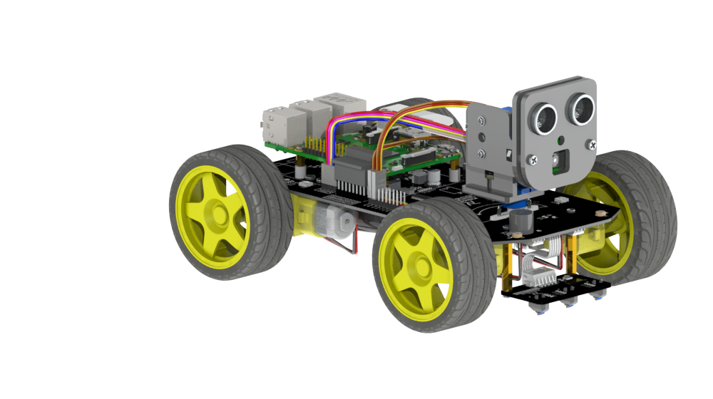
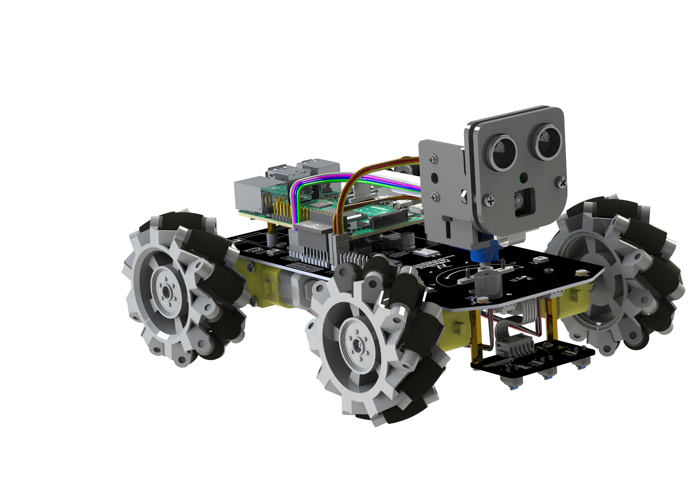
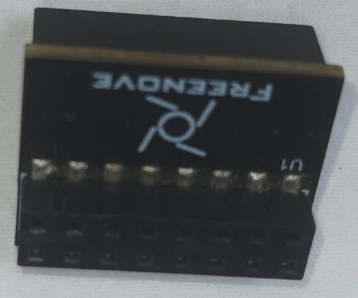
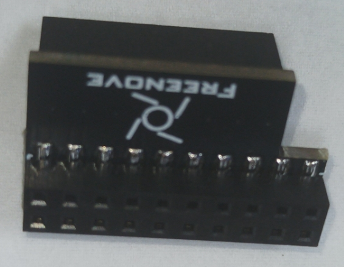

## Freenove 4WD Smart Car Kit for Raspberry Pi

### Please select the corresponding code file according to your Raspberry PI

* **Freenove_4WD_Smart_Car_Kit_for_Raspberry_Pi/Code/Server**

	If you have a Raspberry PI 3 or 4, use the code in the above folder.
	
* **Freenove_4WD_Smart_Car_Kit_for_Raspberry_Pi/Code/Server-pi5**
	
	If you have a Raspberry PI 5, use the code in the above folder.


> A 4WD smart car kit for Raspberry Pi.

<div style="text-align: center;">
  
  
</div>

### Connection Board Version

## Freenove 4WD Smart Car Kit for Raspberry Pi

> A 4WD smart car kit for Raspberry Pi.

<div style="text-align: center;">
  
  
</div>

### Connection Board Version

<table>
  <tr>
    <th>PCB Version</th>
    <th>PCB Picture</th>
  </tr>
  <tr>
    <td>V1.0</td>
    <td align="center">
      
    </td>
  </tr>
  <tr>
    <td>V2.0</td>
    <td align="center">
      
    </td>
  </tr>
</table>

### Download

* **Use command in console**

  Run following command to download all the files in this repository.

  ```bash
  git clone https://github.com/Freenove/Freenove_4WD_Smart_Car_Kit_for_Raspberry_Pi.git


### Download

* **Use command in console**

	Run following command to download all the files in this repository.

	`git clone https://github.com/Freenove/Freenove_4WD_Smart_Car_Kit_for_Raspberry_Pi.git`

* **Manually download in browser**

	Click the green "Clone or download" button, then click "Download ZIP" button in the pop-up window.
	Do NOT click the "Open in Desktop" button, it will lead you to install Github software.

> If you meet any difficulties, please contact our support team for help.

### Support

Freenove provides free and quick customer support. Including but not limited to:

* Quality problems of products
* Using Problems of products
* Questions of learning and creation
* Opinions and suggestions
* Ideas and thoughts

Please send an email to:

[support@freenove.com](mailto:support@freenove.com)

We will reply to you within one working day.

### Purchase

Please visit the following page to purchase our products:

http://store.freenove.com

Business customers please contact us through the following email address:

[sale@freenove.com](mailto:sale@freenove.com)

### Copyright

All the files in this repository are released under [Creative Commons Attribution-NonCommercial-ShareAlike 3.0 Unported License](http://creativecommons.org/licenses/by-nc-sa/3.0/).


This means you can use them on your own derived works, in part or completely. But NOT for the purpose of commercial use.
You can find a copy of the license in this repository.

Freenove brand and logo are copyright of Freenove Creative Technology Co., Ltd. Can't be used without formal permission.


### About

Freenove is an open-source electronics platform.

Freenove is committed to helping customer quickly realize the creative idea and product prototypes, making it easy to get started for enthusiasts of programing and electronics and launching innovative open source products.

Our services include:

* Robot kits
* Learning kits for Arduino, Raspberry Pi and micro:bit
* Electronic components and modules, tools
* Product customization service

Our code and circuit are open source. You can obtain the details and the latest information through visiting the following web site:

http://www.freenove.com