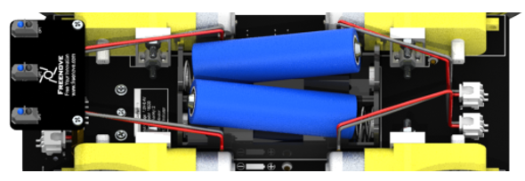

##############################################################################
Chapter 2 Assemble Smart Car
##############################################################################

**If you have any concerns, please feel free to contact us via support@freenove.com**

You can refer to this video

.. raw:: html

   <iframe style="display: block; margin: 0 auto;" height="421.875" width="750" src="https://www.youtube.com/embed/G3Q8xNatXgM" frameborder="0" allowfullscreen></iframe>

.. note:: 
    
    :red:`The difference from the previous video is the installation of the wheels. Please follow STEP 4 of the Wheel installation guide.`

Motor, Wheel and Servo arm 
****************************************************************

Installation steps:
================================================================

Step 0
----------------------------------------------------------------

Place the Rocker arm on the smart car board in accordance with its silkscreen printing. Use two M2.5*8 screws to install it to smart car board.

There are two servo packages. Each package contains one servo, three rocker arms, one M2*4 screw and two M2.5*8 screws, as shown below: 

Step 1
----------------------------------------------------------------

There are 4 bracket packages to fix motors, each containg an aluminum bracket, two M3*30 screws, two M3*8 screws and two M3 nuts, as shown below:

|

Install motor bracket with M3*8.

:red:`You can also attach this bracket to motor first.`

Step 2
----------------------------------------------------------------

Install motor to bracket with M3*30 screw and M3 Nut. 

Step 3
----------------------------------------------------------------

The installation of the rest 3 sets of motor is the same. Then connect motor wires to motor ports. If you think the wires are too long, you can tie a knot.

Step 4 Install the mecanum wheels
----------------------------------------------------------------

Based on the introduction to the mecanum wheels, assemble them following the sequence of A-B-A-B from M1 to M4. 

Slide the mecanum wheel coupling onto the motor's transmission rod.

Attach the wheel to the coupling.

Finally, use the provided screws to tighten the connection securely.

.. note::
    
    Improper installation of the four wheels can lead to issues that prevent the car from functioning correctly. It is essential to strictly adhere to the installation method shown in the diagram to ensure proper functioning and smooth operation of the mecanum wheel-based car.

Infrared line tracking module
================================================================

Step 1
----------------------------------------------------------------

First install two M3*30 standoffs on smart car board with M3*6 screws. Then install line tracking module on standoffs with M3*6 screws.

Step 2
----------------------------------------------------------------

Connect line tracking module to smart car board with XH-2.54-5Pin cable.

Raspberry Pi
================================================================

First install four M2.5*8+6 standoffs to the nuts on smart car board. And then place the Rapberry Pi on the standoff in accordance with its silkscreen printing, and use four M2.5*4 screws to install it. 

Connection board
================================================================

Step 1
----------------------------------------------------------------

Install the connection board as shown in the figure above. Long female header connector should be connected to smart car board and the short one should be connected to Raspberry Pi.

.. note:: 
    
    We have two types of connection boards, but they are installed in the same way.

.. list-table:: 
    :width: 100%
    :widths: 50 50
    :align: center

    *   -   Connection board (PCB_V1.0)  
        -   Connection board (PCB_V2.0)

    *   -   |Chapter2_12|
        -   |Chapter2_13|

.. |Chapter2_12| image:: ../_static/imgs/Chapter_2_Assemble_Smart_Car/Chapter2_12.png
.. |Chapter2_13| image:: ../_static/imgs/Chapter_2_Assemble_Smart_Car/Chapter2_13.png

Step 2
----------------------------------------------------------------

|

.. image:: ../_static/imgs/Chapter_2_Assemble_Smart_Car/Chapter2_15.png
    :align: center

**If you have any concerns, please feel free to contact us via support@freenove.com**

Pan Tilt
================================================================

Finally, install two 18650 batteries. **Please refer to About_Battery.pdf in the unzipped folder.**

:red:`Please push the battery to + ends of battery holder to make the connection good enough.`

Run program
================================================================

In the first chapter, we did not install the Pan-Tilt. Because we need to run programs for the installation of the servos to ensure that the servos rotate to the correct angle. 

Next let us install the Pan-Tilt.

Connect two servos to port Servo0 and port Servo1 on the smart car board. And please remember the numbers of the servos.

Enter the following command in the terminal:

If the terminal displays the directory as below (where test.py is located). You can directly execute the servo.py command. 

.. image:: ../_static/imgs/Chapter_2_Assemble_Smart_Car/Chapter2_18.png
    :align: center

1.If not, execute the cd command:

.. code-block:: console

    $ cd ~/Freenove_4WD_Smart_Car_Kit_for_Raspberry_Pi/Code/Server

2.Execute Servo.py command:

.. code-block:: console

    $ sudo python servo.py

Then servos rotate to a proper angle. Please keep the connection between the servos and the smart car board.

Installation steps: 

.. note::
    
    Do not disorder Servo0 and Servo1 during the installation.

.. list-table:: 
    :width: 100%
    :widths: 50 50 50
    :align: center

    *   -   Step 1  
        -   Step 2
        -   Step 3

    *   -   |Chapter2_19|
        -   |Chapter2_20|
        -   |Chapter2_21|

    *   -   Step 4  
        -   Step 5
        -   Step 6

    *   -   |Chapter2_22|
        -   |Chapter2_23|
        -   |Chapter2_24|

    *   -   Step 7  
        -   Step 8
        -   Step 9

    *   -   |Chapter2_25|
        -   |Chapter2_26|
        -   |Chapter2_27|

Now please refer to :ref:`Wiring Section <fnk0043/codes/mecanum/2_assemble_smart_car:wiring section>` to wring ultrasonic sensor and camera frist.

.. list-table:: 
    :width: 100%
    :widths: 50 50 50
    :align: center

    *   -   Step 10  
        -   Step 11
        -   After finished

    *   -   |Chapter2_28|
        -   |Chapter2_29|
        -   |Chapter2_30|

.. |Chapter2_30| image:: ../_static/imgs/Chapter_2_Assemble_Smart_Car/Chapter2_30.png

Install Pan Tilt on smart car board.

Step 1
----------------------------------------------------------------

Keep the pan tilt as shown in the right picture and install servo0 with rocker arm.

Step 2
----------------------------------------------------------------

Use a Cross screwdrive to support M2 * 10 screws and M2 nuts to fix the servo 0. 

Step 3
----------------------------------------------------------------

Pay attention to servo wiring.

.. note:: 

    :red:`wiring about the ultrasonic and camera module will be introduced later.`

Wiring Section
================================================================

Camera
----------------------------------------------------------------

:blue:`You need shut down Raspberry Pi when wire camera.`

Step 1
^^^^^^^^^^^^^^^^^^^^^^^^^^^^^^^^^^^^^^^^^^^

Step 2
^^^^^^^^^^^^^^^^^^^^^^^^^^^^^^^^^^^^^^^^^^^

The :blue:`Blue side` of cable should be toward to Servo. 

Connect one end of cable to camera. Please note the front and back of the cable. 

Step 3
^^^^^^^^^^^^^^^^^^^^^^^^^^^^^^^^^^^^^^^^^^^

Step 4
^^^^^^^^^^^^^^^^^^^^^^^^^^^^^^^^^^^^^^^^^^^

The :blue:`Blue side` of cable should be toward to Servo. 

Connect one end of cable to camera. Please note the front and back of the cable. 

Camera for Pi5
----------------------------------------------------------------

:blue:`You need shut down Raspberry Pi when wire camera.`

Step 1
^^^^^^^^^^^^^^^^^^^^^^^^^^^^^^^^^^^^^^^^^^^

.. image:: ../_static/imgs/Chapter_2_Assemble_Smart_Car/Chapter2_38.png
    :align: center
    :width: 50%

Step 2
^^^^^^^^^^^^^^^^^^^^^^^^^^^^^^^^^^^^^^^^^^^

Connect one end of cable to camera. Please note the front and back of the cable.

Step 3
^^^^^^^^^^^^^^^^^^^^^^^^^^^^^^^^^^^^^^^^^^^

Step 4
^^^^^^^^^^^^^^^^^^^^^^^^^^^^^^^^^^^^^^^^^^^

Connect another end of cable to Raspberry Pi. Please note the front and back of the cable.

Ultrasonic
----------------------------------------------------------------

Use jumper wires F/F to connect ultrasonic module with pins on smart car board.

**GND-GND, VCC-5V, ECHO-ECHO, TRIG-TRIG**

