##############################################################################
Chapter 3 Module test (necessary)
##############################################################################

**If you have any concerns, please feel free to contact us via support@freenove.com**

In this section, the car must be equipped with **batteries**, and **Both S1** power switch and S2 motor switch need to be **preessed**. Then 5V, 3.3V, battery power indicators will be turned on. 

.. image:: ../_static/imgs/Chapter_3_Module_test/Chapter3_00.png
    :align: center

During the test, the motor will work. So you can disconnect the wheels or put it on the ground to avoid that it falls down and is damaged. Next, test RGB LED, motor, ultrasonic module, servo, etc. 

:red:`You can still power Raspberry Pi with a power supply Cable when switches are pressed.`

If you have never learned python before, you can learn some basic knowledge via the link below: https://python.swaroopch.com/basics.html

Motor
****************************************************************

Run program
================================================================

Open the terminal of Raspberry Pi. Enter the following commands to test the motor.

1. Use the cd command to enter the directory where test.py is located.

.. code-block:: console

    $ cd ~/Freenove_4WD_Smart_Car_Kit_for_Raspberry_Pi/Code/Server

2. Execute test.py command:

.. code-block:: console

    $ sudo python test.py Motor

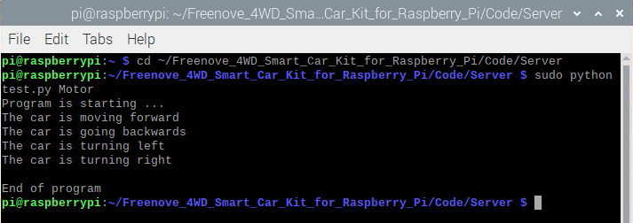

Result: 
----------------------------------------------------------------

The car moves forward for 1 seconds, then moves back for 1 seconds, then turns left for 1 seconds, turns right for 1 seconds, then stops. You can press "Ctrl + C" to end the program ahead of time. :red:`If the car doesn't work normally, please check if both switches are pressed.`

:red:`If the direction is reversed, it moves back then move forward, please follow steps below.`

1. Find Motor.py in the following path in your Raspberry Pi:
   
Freenove_4WD_Smart_Car_Kit_for_Raspberry_Pi/Code/Server/Motor.py

Open Motor.py and add a "–" before duty1,2,3,4 like below. 

.. literalinclude:: ../../../freenove_Kit/Code/Server/motor.py
    :linenos:
    :language: python
    :lines: 66-71
    :dedent:

:red:`Then save the modification and try again.`

Code
================================================================

The code is as below:

.. literalinclude:: ../../../freenove_Kit/Code/Server/test.py
    :linenos: 
    :language: python
    :lines: 22-44

Reference
------------------------------------------

.. py:function:: set_motor_model(data1,data2,data3,data4)

    This function has four input parameters that control the left front motor, the left rear motor, the right front motor, and the right rear motor. When the input parameter is within 0~4096, the motor will rotate forward. If it is within -4096~0, the motor will rotate reversely. The larger the absolute value is, the faster the motor is. When the input is 0, the motor will stop. If the function is input as follows: setMotorModel(2000,2000, 2000, 2000), four motors will rotate forward and the car will move forward.
    
    Now, let's explore how the car accomplishes omnidirectional movement. Drawing from the earlier discussion on mecanum wheel installation, we understand that these wheels can generate two sets of diagonal 45-degree velocities. Each velocity can further be decomposed into two components: one along the X-axis and the other along the Y-axis.
    
    Let's take a closer look at the function " PWM.setMotorModel(-2000,2000,2000,-2000) " mentioned in line seventeen, which enables the car to move to the left. In this function, the parameters represent the speed and direction of each of the four wheels. 

    Since the speed of all four wheels is equal at 2000, the X-axis and Y-axis components of the velocity are also equal. On one side of the car, two wheels generate a forward and a backward velocity, effectively canceling each other out. However, this results in a solitary leftward velocity component. The leftward velocities from both sides combine, thus moving the car laterally to the left.

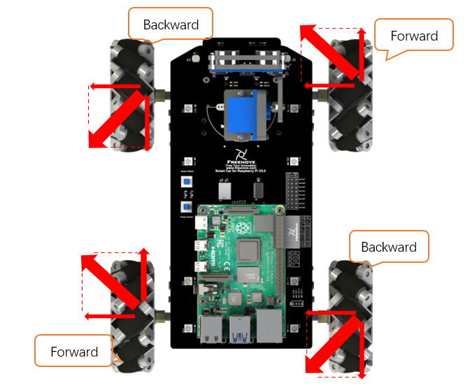

.. image:: ../_static/imgs/Chapter_3_Module_test/Chapter3_02.png
    :align: center

.. table:: 
    :class: zebra
    :align: center

    +-------+-------+-------+-------+----------------------+
    | Data1 | Data2 | Date3 | Data4 | Movements of the Car |
    +=======+=======+=======+=======+======================+
    | X     | X     | X     | X     | Forward              |
    +-------+-------+-------+-------+----------------------+
    | -X    | -X    | -X    | -X    | Backward             |
    +-------+-------+-------+-------+----------------------+
    | -X    | -X    | X     | X     | Turn left            |
    +-------+-------+-------+-------+----------------------+
    | X     | X     | -X    | -X    | Turn right           |
    +-------+-------+-------+-------+----------------------+
    | -X    | X     | X     | -X    | Move left            |
    +-------+-------+-------+-------+----------------------+
    | X     | -X    | -X    | X     | Move right           |
    +-------+-------+-------+-------+----------------------+
    | 0     | X     | X     | 0     | Left and forward     |
    +-------+-------+-------+-------+----------------------+
    | 0     | -X    | -X    | 0     | Right and backward   |
    +-------+-------+-------+-------+----------------------+
    | X     | 0     | 0     | X     | Right and forward    |
    +-------+-------+-------+-------+----------------------+
    | -X    | 0     | 0     | -X    | Left and backward    |
    +-------+-------+-------+-------+----------------------+
    | 0     | 0     | 0     | 0     | Stop                 |
    +-------+-------+-------+-------+----------------------+

The above describes the common actions performed by the Raspberry Pi with fixed and equally-paced movements of mecanum wheels. In this context, X represents a positive integer, with values ranging from 0 to 4096.In this context, X represents a positive integer, with values ranging from 0 to 4096.

Advanced Movements
-----------------------

Open the terminal of Raspberry Pi. Enter the following commands to test the motor.

1. Use the cd command to enter the directory where test.py is located.

.. code-block:: console
    
    cd ~/Freenove_4WD_Smart_Car_Kit_for_Raspberry_Pi/Code/Server

2. Execute test.py command:

.. code-block:: console
    
    sudo python car.py Rotate

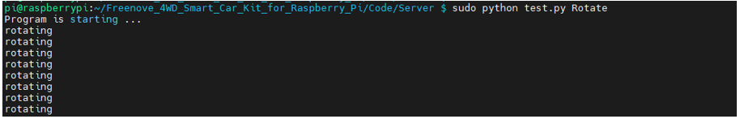

**Result:**

The car rotates while moving straight ahead, and the console continuously prints "rotating". If you find that the car isn't rotating as expected, access the "Motor.py" file and adjust the value of "time_propotion". Here are the detailed steps:

1.	Switch the path  to the program folder 

.. code-block:: console
    
    cd ~/Freenove_4WD_Smart_Car_Kit_for_Raspberry_Pi/Code/Server

2.	Open "Motor.py” with nano editing tool.

.. code-block:: console
    
    sudo nano car.py

3.	Modify the value of "time_propotion”, do not make significant increases or decreases at once; keep the changes within a range of tenths place (one decimal point).

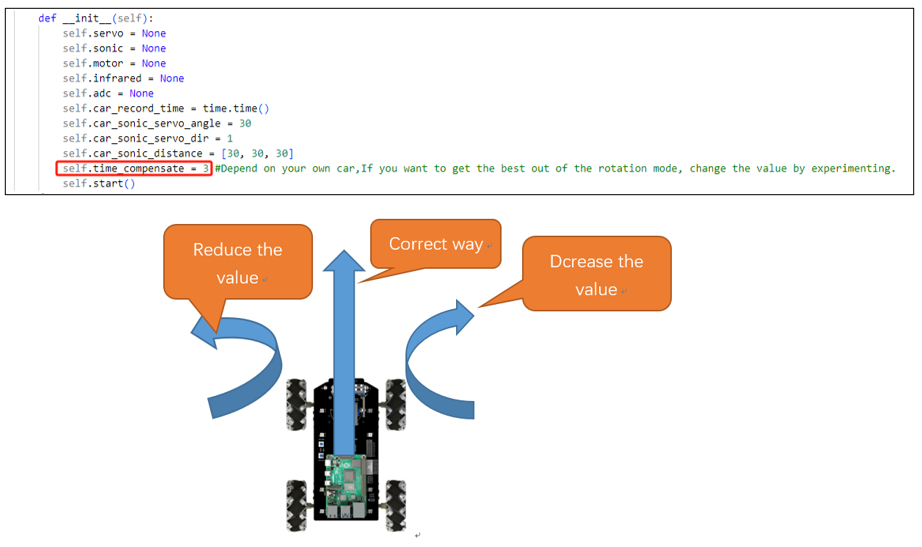

4.	Press Ctrl + O to save the change and Enter to confirm. Exit the editor with Ctrl+x.

.. note::
    
    Changing to an appropriate value is crucial as it determines whether the car can successfully execute both the rotation and the straight movement.

In the preceding basic movements, we employed a fixed and consistent speed, ensuring that all four Mecanum wheels maintained equal velocity. If you are not familiar with the movement of mecanum wheels, please refer to the :ref:`introduction <fnk0043/codes/mecanum/preface:introduction to mecanum wheel>` of mecanum wheels in the preface for more information.

Next, understand how the mecanum wheel car accomplishes both forward movement and rotation. In the program, VY represents the speed mapped to the Y-axis during rotational motion, while VX represents the speed mapped to the X-axis. The angular velocity of the car's rotation is denoted by W, with counterclockwise direction considered positive.

Lines ten to thirteen involve calculating the distribution of speeds to each wheel based on the motion equation of the mecanum wheel chassis. We set an appropriate speed for the car to spin counterclockwise, and use the delay function to rotate the car by 5°. To ensure the direction of forward movement aligns with the rotation, we adjust the corresponding angle by subtracting 5°.

Additionally, the delay function includes a simple voltage linear compensation. You have the option to modify the proportion value "time_proportion" to achieve the best forward rotation effect, tailoring it to your specific requirements.

Reference
---------------------------

.. literalinclude:: ../../../freenove_Kit/Code/Server/car.py
    :linenos:
    :language: python
    :lines: 125-139
    :dedent:

ADC Module
****************************************************************

Run program
================================================================

Enter the following commands to test ADC module.

If the terminal displays the directory as below (where test.py is located). You can directly execute the test.py command. 

.. image:: ../_static/imgs/Chapter_3_Module_test/Chapter3_03.png
    :align: center

1. If not, execute the cd command:

.. code-block:: console

    $ cd ~/Freenove_4WD_Smart_Car_Kit_for_Raspberry_Pi/Code/Server

2. Execute test.py command:

.. code-block:: console

    $ sudo python test.py ADC

.. image:: ../_static/imgs/Chapter_3_Module_test/Chapter3_04.png
    :align: center

Result: 
----------------------------------------------------------------

Every 1s, the voltage values of the two photoresistors and the battery are output. The value read for the first time is not stable and inaccurate when the chip just starts. It will be stable later. You can press "Ctrl + C" to end program.

Code
================================================================

The code is as below:

.. literalinclude:: ../../../freenove_Kit/Code/Server/test.py
    :linenos: 
    :language: python
    :lines: 109-125

Reference
================================================================

.. py:function:: recvADC(channel)

    This function has only one input parameter, which can be 0, 1 or 2. 
    
    When the input is 0, the value of this function is the voltage value of the **left** photoresistor. 
    
    When the input is 1, the value of this function is the voltage value of the **right** photoresistor. 
    
    When the input is 2, the value of this function is the voltage value of **each battery**. After multiplying by 3, it is the actual battery voltage value

Infrared Line tracking module
****************************************************************

Run program
================================================================

Enter the following command in the terminal to test line tracking module.

If the terminal displays the directory as below (where test.py is located), you can directly execute the test.py command. 

.. image:: ../_static/imgs/Chapter_3_Module_test/Chapter3_05.png

1. If not, execute the cd command:

.. code-block:: console

    $ cd ~/Freenove_4WD_Smart_Car_Kit_for_Raspberry_Pi/Code/Server

2. Execute test.py command:

.. code-block:: console

    $ sudo python test.py Infrared

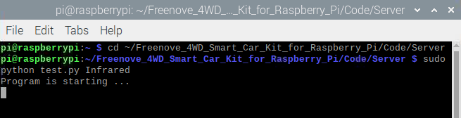

Result: 
----------------------------------------------------------------

When the black line is on the left side of the module, the left LED will light up and the terminal will print "Left”; 

When the black line is in the middle of the module, the middle LED will light up and the terminal will print "Middle”.

When the black line is on the right side of the module, right The LED will light up, the terminal will print "Right”, You can press "Ctrl + C” to end the program.

If there are issues with the test, the infrared device may need to be adjusted. The adjustment screw is on top of the sensor. 

.. image:: ../_static/imgs/Chapter_3_Module_test/Chapter3_07.png
    :align: center

Code
================================================================

The code is as below:

.. literalinclude:: ../../../freenove_Kit/Code/Server/test.py
    :linenos: 
    :language: python
    :lines: 63-82

LED
****************************************************************

.. note:: 

    :red:`Raspberry PI 5 is temporarily unavailable because the Library rpi-ws281x-python does not support Raspberry PI 5. Please skip this section.`

There are 8 RGB LEDs on the smart car board, as shownbelow. You can control them separately. 

.. image:: ../_static/imgs/Chapter_3_Module_test/Chapter3_08.png
    :align: center

Run program
================================================================

Enter the following commands to test LEDs.

If the terminal displays the directory as below (where test.py is located), you can directly execute the test.py command. 

1. If not, execute the cd command:

.. code-block:: console

    $ cd ~/Freenove_4WD_Smart_Car_Kit_for_Raspberry_Pi/Code/Server

2. Execute test.py command:

.. code-block:: console

    $ sudo python test.py Led

If you are using the Led feature for the first time, it will ask for the PCB version of the connection board.

.. image:: ../_static/imgs/Chapter_3_Module_test/Chapter3_10.png
    :align: center

Please enter 1 or 2 according to the version number of your connection board.

.. list-table:: 
    :width: 100%
    :widths: 50 50
    :align: center

    *   -   Connection board (PCB_V1.0)  
        -   Connection board (PCB_V2.0)

    *   -   |Chapter2_12|
        -   |Chapter2_13|

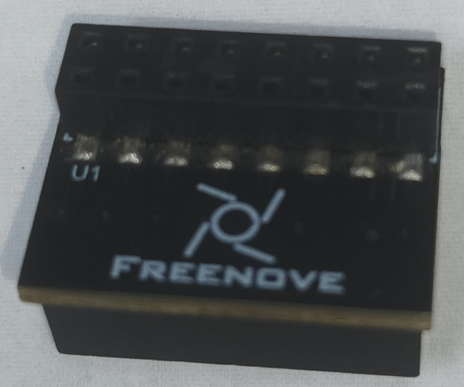
.. |Chapter2_13| image:: ../_static/imgs/Chapter_2_Assemble_Smart_Car/Chapter2_13.png

In this example, PCB V2.0 is used. Enter 2 and press Enter. 

.. image:: ../_static/imgs/Chapter_3_Module_test/Chapter3_11.png
    :align: center

:red:`If your connection board version is V2.0 and you do not have the SPI feature turned on, the LedPixel will not show the color. Refer here to turn on the SPI.`

Result: 
----------------------------------------------------------------

All LEDs will be turned on for 3 seconds, and colors from LED0 to LED7 are: red, orange, yellow, green, cyan, blue, purple, and white. You can end the program ahead of time by pressing "ctrl+c". 

If the LED color display order is not correct, open the **"Led.py"** file in the current directory and modify the value of the "self.ORDER" variable on line 15.

Code
================================================================

The code is as below:

.. literalinclude:: ../../../freenove_Kit/Code/Server/test.py
    :linenos: 
    :language: python
    :lines: 1-20

Reference
================================================================

.. py:function:: ledIndex( Index, R, G, B)

    This function has 4 parameters. 
    
    The first one is the index of the LED that you want to control. Its value is hexadecimal. There are LED0~7.
    
    The rest 3 parameters are R G B value of color respectively.
    
    For example, ledindex(0x01,255,0,0) makes LED 0 light to red; ledeindex(0x40,0,255,0) makes LED 6 light green.

.. py:function:: colorBlink(state, wait_ms)	

    When the state is 0, the lights will be turned off. When state is 1, the red, green, and blue colors are displayed in a non-blocking loop. wait_ms Indicates the time interval. The default value is 300ms.

Buzzer
****************************************************************

Run program
================================================================

Enter the following command in the terminal to test buzzer.

If the terminal displays the directory as below (where test.py is located). You can directly execute the test.py command. 

.. image:: ../_static/imgs/Chapter_3_Module_test/Chapter3_12.png

1. If not, execute the cd command:

.. code-block:: console

    $ cd ~/Freenove_4WD_Smart_Car_Kit_for_Raspberry_Pi/Code/Server

2. Execute test.py command:

.. code-block:: console

    $ sudo python test.py Buzzer

.. image:: ../_static/imgs/Chapter_3_Module_test/Chapter3_13.png
    :align: center

Result: 
----------------------------------------------------------------

The buzzer will be turned on and last for 3s. Then the program will automatically end or you can press "Ctrl + C" to end the program.

Code
================================================================

The code is as below:

.. literalinclude:: ../../../freenove_Kit/Code/Server/test.py
    :linenos: 
    :language: python
    :lines: 127-144

Reference
================================================================

.. py:function:: buzzer.set_state(bool)

    This function has one input parameter. If the input is true, the buzzer will be turned on. If the input is false, the buzzer will be turned off. 

Servo
****************************************************************

Run program
================================================================

Enter the following commands in the terminal to test servos.

If the terminal displays the directory as below (where test.py is located), you can directly execute the test.py command. 

.. image:: ../_static/imgs/Chapter_3_Module_test/Chapter3_14.png

1. If not, execute the cd command:

.. code-block:: console

    $ cd ~/Freenove_4WD_Smart_Car_Kit_for_Raspberry_Pi/Code/Server

2. Execute test.py command:

.. code-block:: console

    $ sudo python test.py Servo

.. image:: ../_static/imgs/Chapter_3_Module_test/Chapter3_15.png
    :align: center

Result: 
----------------------------------------------------------------

The servo 0 repeats rotating from left to right and then from right to left. The servo 1 repeats rotating from bottom to top and then from top to bottom. You can press "Ctrl + C” to end the program.

Code
================================================================

The code is as below:

.. literalinclude:: ../../../freenove_Kit/Code/Server/test.py
    :linenos: 
    :language: python
    :lines: 84-107

Reference
================================================================

.. py:function:: setServoPwm(Servo,angle)

    There are 2 parameters.
    
    The first one is related to servo index.
    
    The second one is related to the angle of servos. 
    
    For example,
    
    setServoPwm('0',20) makes servo0 rotate to 20°.
    
    setServoPwm('1',90) makes servo1 rotate to 90°.

Ultrasonic module
****************************************************************

Next, use jumper wires F/F to connect ultrasonic module with pins on smart car board.

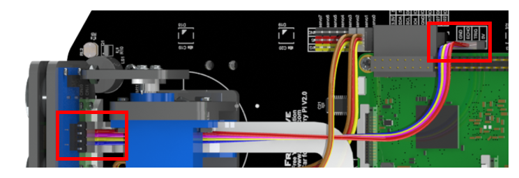

When connecting the ultrasonic module, you need disconnect the Servo1 cable, so that the servo can rotate freely, and after the wiring is completed, connect the servo cable again. When wiring, you should keep the silk screen of the ultrasonic module and the smart car board consistent. Vcc should be connected to 5V, Trig to TRIG, Echo to ECHO, and Gnd to GND.

If the connection is wrong, for example, if Vcc is connected to GND, and Gnd is connected to 5V, it will cause the damage to ultrasonic module. After the wiring is completed, you can start testing.

Run program
================================================================

Enter following command in the terminal:

If the terminal displays the directory as below (where test.py is located). You can directly execute the test.py command. 

.. image:: ../_static/imgs/Chapter_3_Module_test/Chapter3_17.png
    :align: center

1. If not, execute the cd command:

.. code-block:: console

    $ cd ~/Freenove_4WD_Smart_Car_Kit_for_Raspberry_Pi/Code/Server

2. Execute test.py command:

.. code-block:: console

    $ sudo python test.py Ultrasonic

.. image:: ../_static/imgs/Chapter_3_Module_test/Chapter3_18.png
    :align: center

Result: 
----------------------------------------------------------------

Every 1s, the distance between the obstacle and the ultrasonic module will be printed out, and you can press "Ctrl + C" to end the program.

Code
================================================================

The code is as below:

.. literalinclude:: ../../../freenove_Kit/Code/Server/test.py
    :linenos: 
    :language: python
    :lines: 46-61

Reference
================================================================

.. py:function:: get_distance()

    This function is used to obtain the distance between ultrasonic module and obstacles in front of it, with unit CM.

Camera 
****************************************************************

Next let us connect the camera to smart car board. First :red:`turn off S1` (Power Switch), :red:`shut down Raspberry Pi` and disconnect power cable. If the data cable is used to power the Raspberry Pi, disconnect the data cable and install the CSI camera to the Raspberry Pi camera interface when the Raspberry Pi is powered off. :red:`(The CSI camera must be connected or disconnected under no power and when Raspberry Pi is shut down, or the camera may be burned.)`

Camera for Pi3/4
===========================

Step1
----------------------------

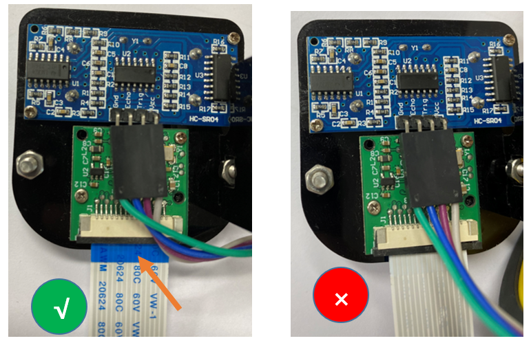

The :blue:`Blue side` of cable should be toward to Servo. 

Connect one end of cable to camera. Please note the front and back of the cable. 

Step2
----------------------------

.. image:: ../_static/imgs/Chapter_3_Module_test/Chapter3_20.png
    :align: center

The :blue:`Blue side` of cable should be toward to Servo. 

Connect one end of cable to camera. Please note the front and back of the cable. 

Camera for Pi5
===========================

:combo:`bg-blue:You need shut down Raspberry Pi when wire camera.`

Step 1

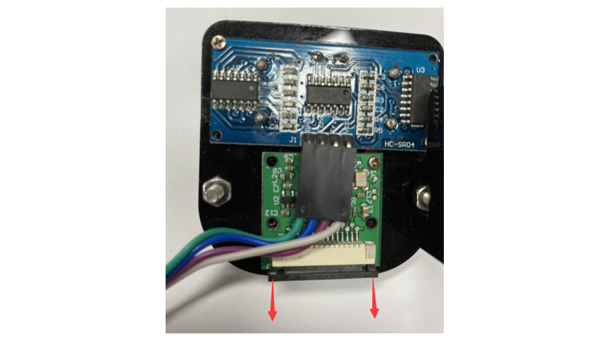

Step 2

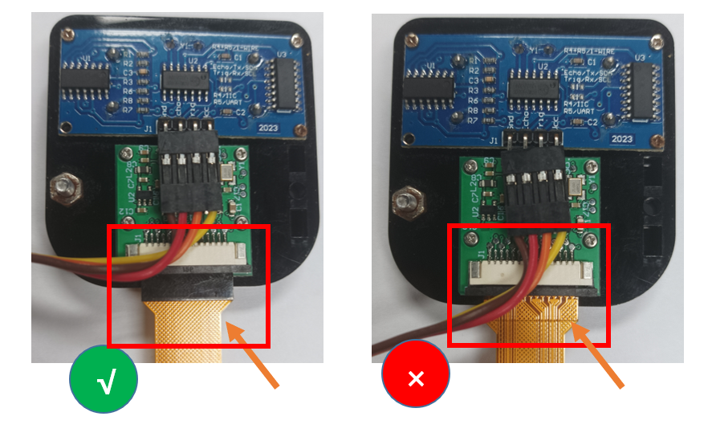

Connect one end of cable to camera. Please note the front and back of the cable. 

Step 3

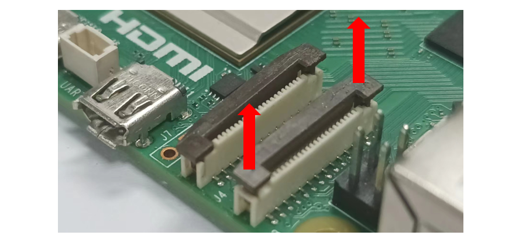

Step 4

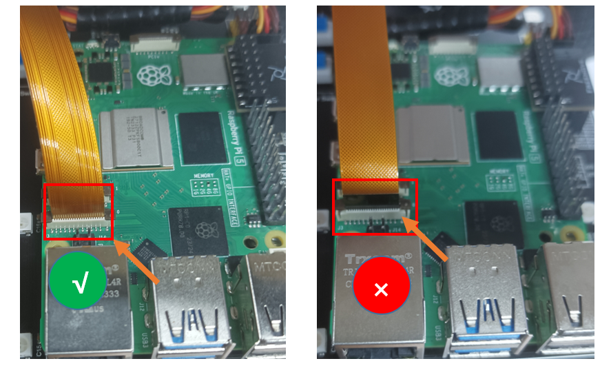

Connect another end of cable to Raspberry Pi. Please note the front and back of the cable.

There are two ways to drive the camera.

First method, use the system's default camera detection function.

1.	Open the config.txt file.

.. code-block:: console
    
    sudo nano /boot/firmware/config.txt

2.	Enable the automatic camera detection function.

.. code-block:: python
    
    camera_auto_detect=1

Second method, manually configure the camera.

1.	Disable the automatic camera detection function.

.. code-block:: python
    
    camera_auto_detect=0

2.	Add the following instruction at the very bottom.

If you are a Raspberry PI 5, add the following command.

.. code-block:: python
    
    dtoverlay = ov5647,cam0

If you are not a Raspberry PI 5, add the following command.

.. code-block:: python
    
    dtoverlay = ov5647

3.	Save the file and exit, then restart the Raspberry PI.

Run program
================================================================

1.	execute the cd command:

.. code-block:: console

    $ cd ~/Freenove_4WD_Smart_Car_Kit_for_Raspberry_Pi/Code/Server

2.	Execute the following command:

.. code-block:: console

    $ python camera.py

Then please open and check the generated image.jpg under

/Freenove_4WD_Smart_Car_Kit_for_Raspberry_Pi/Code/Server. 

.. image:: ../_static/imgs/Chapter_3_Module_test/Chapter3_31.png
    :align: center

.. image:: ../_static/imgs/Chapter_3_Module_test/Chapter3_30.png
    :align: center