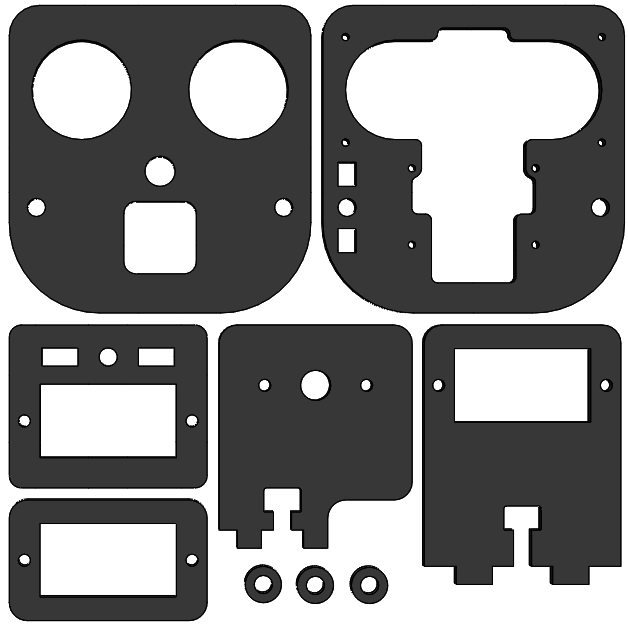
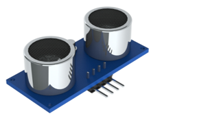
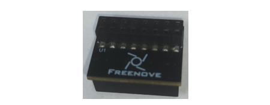
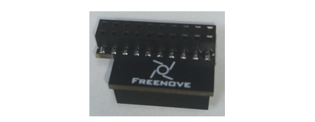
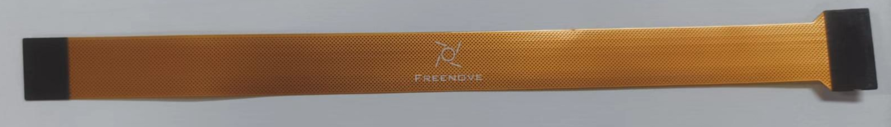

##############################################################################
List
##############################################################################

If you have any concerns, please feel free to contact us via support@freenove.com

4WD Smart Car Board for Raspberry Pi
****************************************************************

.. image:: ../_static/imgs/List/List00.png
  :width: 45%

.. image:: ../_static/imgs/List/List01.png
  :width: 45%
  
Machinery Parts
****************************************************************

.. list-table::
   :align: center
   :class: table-line

   * - |List02|
     - |List03|
     - |List04|
     - |List05|
     - |List06|

   * - |List07|
     - |List08|
     - |List09|
     - |List10|
     - 

.. |List02| image:: ../_static/imgs/List/List02.png
.. |List03| image:: ../_static/imgs/List/List03.png
.. |List04| image:: ../_static/imgs/List/List04.png
.. |List05| image:: ../_static/imgs/List/List05.png
.. |List06| image:: ../_static/imgs/List/List06.png
.. |List07| image:: ../_static/imgs/List/List07.png
.. |List08| image:: ../_static/imgs/List/List08.png
.. |List09| image:: ../_static/imgs/List/List09.png
.. |List10| image:: ../_static/imgs/List/List10.png

.. note::
    
    :red:`You may receive M1.4*4 or M1.4*5. Can be used normally`

Transmission Parts
****************************************************************

.. table:: 
  :align: center
  :class: table-line
  :width: 80%

  +-------------------------------------------------------------+---------------------------+---------------------------------------+
  | Servo package x2                                            | Mecanum wheel x4(2*2)                                             |
  |                                                             |                                                                   |
  | |List11|                                                    | |List30|                                                          |
  +-------------------------------------------------------------+---------------------------+---------------------------------------+
  | DC speed reduction motor x4                                 | Motor bracket package  x4 | Coupling & screw for mecanum wheel x4 |
  |                                                             |                           |                                       |
  | :red:`Caution: Do not remove the cable tie from the motor;` | |List14|                  | |List31|                              |
  |                                                             |                           |                                       |
  | :red:`otherwise, the motor cable may become detached.`      |                           |                                       |
  |                                                             |                           |                                       |
  | |List13|                                                    |                           |                                       |
  +-------------------------------------------------------------+---------------------------+---------------------------------------+

.. |List11| image:: ../_static/imgs/List/List11.png

.. |List13| image:: ../_static/imgs/List/List13.png
.. |List14| image:: ../_static/imgs/List/List14.png

Acrylic Parts
****************************************************************

.. container:: centered
    
    :xx-large:`For Pan Tilt`

  
Electronic Parts
****************************************************************

.. note::

  :combo:`red font-bolder:There are two models of connection boards, remember their version numbers.`
  
.. table:: 
  :align: center
  :class: table-line
  :width: 80%

  +---------------------------+---------------------------------+-----------------------------------+
  |  Line tracking module x1  |  Camera x1                      | HC-SR04 Ultrasonic Module x1      |   
  |                           |                                 |                                   |   
  |    |List16|               |   |List17|                      |   |List18|                        |   
  +---------------------------+----------------+----------------+-----------------------------------+
  | Connection board (PCB_V1.0)                |  Connection board (PCB_V2.0)                       |   
  |                                            |                                                    |   
  |    |List19|                                |    |List20|                                        |   
  +--------------------------------------------+----------------------------------------------------+
  | Note:                                                                                           |
  |                                                                                                 |
  | The PCB Version 2 is not on sale yet. They are current at our warehouse.                        |
  |                                                                                                 |
  | The only distinction between Version 1 and Version 2 of the adapter board lies in the           |
  | modification of the LED control pin.                                                            |
  |                                                                                                 |
  | Version 1 employs GPIO18, whereas Version 2 has switched to GPIO10.                             |
  |                                                                                                 |
  | Due to significant changes in the Raspberry Pi 5, the library rpi-ws281x-python is              |
  | unable to function properly.                                                                    |
  |                                                                                                 |
  | This library was designed to work with GPIO18, and the lack of detailed documentation           |
  | on the RP1 chip from the Raspberry Pi authorities has hindered the resolution of this           |
  | issue.                                                                                          |
  |                                                                                                 |
  | Consequently, we have introduced an alternative approach, utilizing the SPI MOSI pin            |
  | for communication with the LED lights.                                                          |
  |                                                                                                 |
  | Although this restored the functionality of the LEDs, it also meant that SPI-related            |
  | pins (SCK, MISO) could not be used for other purposes.                                          |
  |                                                                                                 |
  | This serves as an interim measure, and once the rpi-ws281x-python library resumes               |
  | normal functionality on pi 5, Version 2 is expected to be phased out.                           |
  |                                                                                                 |
  | :red:`If you want to achieve the function of V2, you can connect GPIO10 to GPIO18               |
  | with a jumper wire, as shown below.`                                                            |
  |                                                                                                 |
  | |List32|                                                                                        |
  +-------------------------------------------------------------------------------------------------+
  |  Jumper Wire F/F(4) x1                                                                          |   
  |                                                                                                 |   
  |    |List21|                                                                                     |   
  +-------------------------------------------------------------------------------------------------+
  |  XH-2.54-5Pin cable x1                                                                          |   
  |                                                                                                 |   
  |    |List22|                                                                                     |   
  +-------------------------------------------------------------------------------------------------+
  |  FPC soft line x1                                                                               |   
  |                                                                                                 |   
  |    |List23|                                                                                     |   
  +-------------------------------------------------------------------------------------------------+
  |  FPC soft line x1                                                                               |   
  |                                                                                                 |   
  |    |List24|                                                                                     |   
  +-------------------------------------------------------------------------------------------------+

.. note::

    :combo:`red font-bolder:Please note that this cable only come with the purchase of the Raspberry Pi 5 version.`

.. |List16| image:: ../_static/imgs/List/List16.png
.. |List17| image:: ../_static/imgs/List/List17.png

.. |List21| image:: ../_static/imgs/List/List21.png
.. |List22| image:: ../_static/imgs/List/List22.png
.. |List23| image:: ../_static/imgs/List/List23.png

Tools
****************************************************************

.. list-table::
   :align: center
   :widths: 60 50 50
   :class: table-line

   * - Cross screwdriver (3mm) x1
     - Black tape x1
     - Cable Tidy x25cm

   * - |List25|
     - |List26|
     - |List27|

.. |List25| image:: ../_static/imgs/List/List25.png
    :width: 70%
.. |List26| image:: ../_static/imgs/List/List26.png
.. |List27| image:: ../_static/imgs/List/List27.png

Self-prepared Parts
****************************************************************

.. table:: 
  :align: center
  :class: table-line
  :width: 80%

  +-------------------------------------------------------------------------------------------+
  | Please refer to About_Battery.pdf in unzipped folder.                                     |   
  |                                                                                           |   
  |    |List28|                                                                               |   
  +-------------------------------------------------------------------------------------------+
  | Raspberry Pi (:red:`Recommended model: Raspberry 5 / 4B / 3B+`) x1                        |   
  |                                                                                           |   
  |    |List29|                                                                               |   
  +-------------------------------------------------------------------------------------------+

.. |List29| image:: ../_static/imgs/List/List29.png