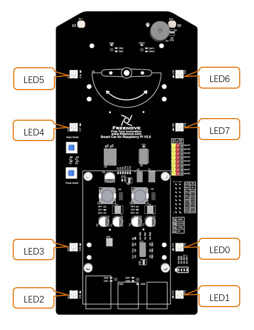
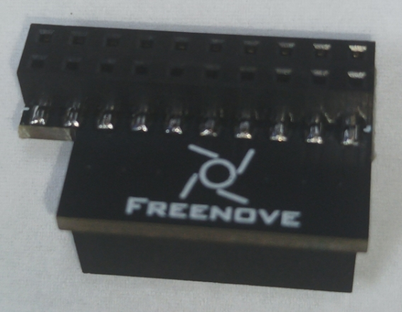

##############################################################################
Chapter 3 Module test (necessary)
##############################################################################

**If you have any concerns, please feel free to contact us via support@freenove.com**

In this section, the car must be equipped with **batteries**, and **Both S1** power switch and S2 motor switch need to be **preessed**. Then 5V, 3.3V, battery power indicators will be turned on. 

During the test, the motor will work. So you can disconnect the wheels or put it on the ground to avoid that it falls down and is damaged. Next, test RGB LED, motor, ultrasonic module, servo, etc. 

:red:`You can still power Raspberry Pi with a power supply Cable when switches are pressed.`

If you have never learned python before, you can learn some basic knowledge via the link below: https://python.swaroopch.com/basics.html

.. _Motor:

Motor
****************************************************************

Run program
================================================================

Open the terminal of Raspberry Pi. Enter the following commands to test the motor.

1. Use the cd command to enter the directory where test.py is located.

.. code-block:: console

    $ cd ~/Freenove_4WD_Smart_Car_Kit_for_Raspberry_Pi/Code/Server

2. Execute test.py command:

.. code-block:: console

    $ sudo python test.py Motor

.. image:: ../_static/imgs/Chapter_3_Module_test/Chapter3_01.png
    :align: center

Result: 
----------------------------------------------------------------

The car moves forward for 1 seconds, then moves back for 1 seconds, then turns left for 1 seconds, turns right for 1 seconds, then stops. You can press "Ctrl + C" to end the program ahead of time. :red:`If the car doesn't work normally, please check if both switches are pressed.`

:red:`If the direction is reversed, it moves back then move forward, please follow steps below.`

1. Find Motor.py in the following path in your Raspberry Pi:
   
Freenove_4WD_Smart_Car_Kit_for_Raspberry_Pi/Code/Server/Motor.py

Open Motor.py and add a “–“ before duty1,2,3,4 like below. 

.. code-block:: python

    def setMotorModel(self,duty1,duty2,duty3,duty4):
        duty1,duty2,duty3,duty4=self.duty_range(duty1,duty2,duty3,duty4)
        self.left_Upper_Wheel(-duty1)
        self.left_Lower_Wheel(-duty2)
        self.right_Upper_Wheel(-duty3)
        self.right_Lower_Wheel(-duty4)

:red:`Then save the modification and try again.`

Code
================================================================

The code is as below:

.. literalinclude:: ../../../freenove_Kit/Code/Server/test.py
    :linenos: 
    :language: python
    :lines: 22-62

Reference
================================================================

.. py:function:: setMotorModel(data1,data2,data3,data4)

    This function has four input parameters that control the left front motor, the left rear motor, the right front motor, and the right rear motor. When the input parameter is within 0~4096, the motor will rotate forward. If it is within -4096~0, the motor will rotate reversely. The larger the absolute value is, the faster the motor is. When the input is 0, the motor will stop. If the function is input as follows: setMotorModel(2000,2000, 2000, 2000), four motors will rotate forward and the car will move forward.

.. _ADC:

ADC Module
****************************************************************

Run program
================================================================

Enter the following commands to test ADC module.

If the terminal displays the directory as below (where test.py is located). You can directly execute the test.py command. 

.. image:: ../_static/imgs/Chapter_3_Module_test/Chapter3_03.png

1. If not, execute the cd command:

.. code-block:: console

    $ cd ~/Freenove_4WD_Smart_Car_Kit_for_Raspberry_Pi/Code/Server

2. Execute test.py command:

.. code-block:: console

    $ sudo python test.py ADC

Result: 
----------------------------------------------------------------

Every 1s, the voltage values of the two photoresistors and the battery are output. The value read for the first time is not stable and inaccurate when the chip just starts. It will be stable later. You can press "Ctrl + C" to end program.

Code
================================================================

The code is as below:

.. literalinclude:: ../../../freenove_Kit/Code/Server/test.py
    :linenos: 
    :language: python
    :lines: 115-129

Reference
================================================================

.. py:function:: recvADC(channel)

    This function has only one input parameter, which can be 0, 1 or 2. 
    
    When the input is 0, the value of this function is the voltage value of the left photoresistor. 
    
    When the input is 1, the value of this function is the voltage value of the right photoresistor. 
    
    When the input is 2, the value of this function is the voltage value of each battery. After multiplying by 3, it is the actual battery voltage value

Infrared Line tracking module
****************************************************************

Run program
================================================================

Enter the following command in the terminal to test line tracking module.

If the terminal displays the directory as below (where test.py is located), you can directly execute the test.py command. 

.. image:: ../_static/imgs/Chapter_3_Module_test/Chapter3_05.png

1. If not, execute the cd command:

.. code-block:: console

    $ cd ~/Freenove_4WD_Smart_Car_Kit_for_Raspberry_Pi/Code/Server

2. Execute test.py command:

.. code-block:: console

    $ sudo python test.py Infrared

.. image:: ../_static/imgs/Chapter_3_Module_test/Chapter3_06.png
    :align: center

Result: 
----------------------------------------------------------------

When the black line is on the left side of the module, the left LED will light up and the terminal will print “Left”; 

When the black line is in the middle of the module, the middle LED will light up and the terminal will print “Middle”.

When the black line is on the right side of the module, right The LED will light up, the terminal will print “Right”, You can press “Ctrl + C” to end the program.

If there are issues with the test, the infrared device may need to be adjusted. The adjustment screw is on top of the sensor. 

Code
================================================================

The code is as below:

.. literalinclude:: ../../../freenove_Kit/Code/Server/test.py
    :linenos: 
    :language: python
    :lines: 83-89

Reference
================================================================

.. py:function:: GPIO.input(IO)

    This function has an input parameter. If the IO input is high level, GPIO.input(IO) returns True. If the IO input is low level, GPIO.input(IO) returns False. 

.. _LED:

LED
****************************************************************

There are 8 RGB LEDs on the smart car board, as shownbelow. You can control them separately. 

Run program
================================================================

Enter the following commands to test LEDs.

If the terminal displays the directory as below (where test.py is located), you can directly execute the test.py command. 

.. image:: ../_static/imgs/Chapter_3_Module_test/Chapter3_09.png

1. If not, execute the cd command:

.. code-block:: console

    $ cd ~/Freenove_4WD_Smart_Car_Kit_for_Raspberry_Pi/Code/Server

2. Execute test.py command:

.. code-block:: console

    $ sudo python test.py Led

If you are using the Led feature for the first time, it will ask for the PCB version of the connection board.

Please enter 1 or 2 according to the version number of your connection board.

.. list-table:: 
    :width: 100%
    :widths: 50 50
    :align: center

    *   -   Connection board (PCB_V1.0)  
        -   Connection board (PCB_V2.0)

    *   -   |Chapter2_12|
        -   |Chapter2_13|

.. |Chapter2_12| image:: ../_static/imgs/Chapter_2_Assemble_Smart_Car/Chapter2_12.png

In this example, PCB V2.0 is used. Enter 2 and press Enter. 

Result: 
----------------------------------------------------------------

All LEDs will be turned on for 3 seconds, and colors from LED0 to LED7 are: red, orange, yellow, green, cyan, blue, purple, and white. You can end the program ahead of time by pressing "ctrl+c". 

If the LED color display order is not correct, open the "Led.py" file in the current directory and modify the value of the "self.ORDER" variable on line 15.

Code
================================================================

The code is as below:

.. literalinclude:: ../../../freenove_Kit/Code/Server/test.py
    :linenos: 
    :language: python
    :lines: 4-20

Reference
================================================================

.. py:function:: ledIndex( Index, R, G, B)

    This function has 4 parameters. 
    
    The first one is the index of the LED that you want to control. Its value is hexadecimal. There are LED0~7.
    
    The rest 3 parameters are R G B value of color respectively.
    
    For example, ledindex(0x01,255,0,0) makes LED 0 light to red; ledeindex(0x40,0,255,0) makes LED 6 light green.

.. py:function:: colorWipe(strip, color, wait_ms)

    This function erases the color of one pixel at a time. It has three input parameters: strip represents the Neopixel object, color represents the color to be erased, and wait_ms represents the erasure interval. The default is 50ms. For example, colorWipe(strip, Color(255,0,0),20) means that the LED0 is red first, wait for 20ms, and then the LED1 is also red, until all eight LEDs are lit and red.

.. _Buzzer:

Buzzer
****************************************************************

Run program
================================================================

Enter the following command in the terminal to test buzzer.

If the terminal displays the directory as below (where test.py is located). You can directly execute the test.py command. 

.. image:: ../_static/imgs/Chapter_3_Module_test/Chapter3_12.png

1. If not, execute the cd command:

.. code-block:: console

    $ cd ~/Freenove_4WD_Smart_Car_Kit_for_Raspberry_Pi/Code/Server

2. Execute test.py command:

.. code-block:: console

    $ sudo python test.py Buzzer

Result: 
----------------------------------------------------------------

The buzzer will be turned on and last for 3s. Then the program will automatically end or you can press "Ctrl + C" to end the program.

Code
================================================================

The code is as below:

.. literalinclude:: ../../../freenove_Kit/Code/Server/test.py
    :linenos: 
    :language: python
    :lines: 131-146

Reference
================================================================

.. py:function:: buzzer.run(cmd)

    This function has one input parameter. If the input is '1', the buzzer will be turned on. If the input is '0', the buzzer will be turned off. 

.. _Servo:

Servo
****************************************************************

Run program
================================================================

Enter the following commands in the terminal to test servos.

If the terminal displays the directory as below (where test.py is located), you can directly execute the test.py command. 

.. image:: ../_static/imgs/Chapter_3_Module_test/Chapter3_14.png

1. If not, execute the cd command:

.. code-block:: console

    $ cd ~/Freenove_4WD_Smart_Car_Kit_for_Raspberry_Pi/Code/Server

2. Execute test.py command:

.. code-block:: console

    $ sudo python test.py Servo

Result: 
----------------------------------------------------------------

The servo 0 repeats rotating from left to right and then from right to left. The servo 1 repeats rotating from bottom to top and then from top to bottom. You can press “Ctrl + C” to end the program.

Code
================================================================

The code is as below:

.. literalinclude:: ../../../freenove_Kit/Code/Server/test.py
    :linenos: 
    :language: python
    :lines: 92-112

Reference
================================================================

.. py:function:: setServoPwm(Servo,angle)

    There are 2 parameters.
    The first one is related to servo index.
    The second one is related to the angle of servos. 
    For example,
    setServoPwm('0',20) makes servo0 rotate to 20°.
    setServoPwm('1',90) makes servo1 rotate to 90°.

.. _Ultrasonic module:

Ultrasonic module
****************************************************************

Next, use jumper wires F/F to connect ultrasonic module with pins on smart car board.

.. image:: ../_static/imgs/Chapter_3_Module_test/Chapter3_16.png
    :align: center

When connecting the ultrasonic module, you need disconnect the Servo1 cable, so that the servo can rotate freely, and after the wiring is completed, connect the servo cable again. When wiring, you should keep the silk screen of the ultrasonic module and the smart car board consistent. Vcc should be connected to 5V, Trig to TRIG, Echo to ECHO, and Gnd to GND.

If the connection is wrong, for example, if Vcc is connected to GND, and Gnd is connected to 5V, it will cause the damage to ultrasonic module. After the wiring is completed, you can start testing.

Run program
================================================================

Enter following command in the terminal:

If the terminal displays the directory as below (where test.py is located). You can directly execute the test.py command. 

.. image:: ../_static/imgs/Chapter_3_Module_test/Chapter3_17.png
    :align: center

1. If not, execute the cd command:

.. code-block:: console

    $ cd ~/Freenove_4WD_Smart_Car_Kit_for_Raspberry_Pi/Code/Server

2. Execute test.py command:

.. code-block:: console

    $ sudo python test.py Ultrasonic

Result: 
----------------------------------------------------------------

Every 1s, the distance between the obstacle and the ultrasonic module will be printed out, and you can press "Ctrl + C" to end the program.

Code
================================================================

The code is as below:

.. literalinclude:: ../../../freenove_Kit/Code/Server/test.py
    :linenos: 
    :language: python
    :lines: 65-74

Reference
================================================================

.. py:function:: get_distance()

    This function is used to obtain the distance between ultrasonic module and obstacles in front of it, with unit CM.

Camera 
****************************************************************

Next let us connect the camera to smart car board. First :red:`turn off S1` (Power Switch), :red:`shut down Raspberry Pi` and disconnect power cable. If the data cable is used to power the Raspberry Pi, disconnect the data cable and install the CSI camera to the Raspberry Pi camera interface when the Raspberry Pi is powered off. :red:`(The CSI camera must be connected or disconnected under no power and when Raspberry Pi is shut down, or the camera may be burned.)`

Step1
================================================================

.. image:: ../_static/imgs/Chapter_3_Module_test/Chapter3_19.png
    :align: center

The :blue:`Blue side` of cable should be toward to Servo. 

Connect one end of cable to camera. Please note the front and back of the cable. 

Step2
================================================================

The :blue:`Blue side` of cable should be toward to Servo. 

Connect one end of cable to camera. Please note the front and back of the cable. 

Run program
================================================================

To use the camera, you need to disable legacy camera, which is disabled by default on the latest Raspberry Pi OS. If it is not disabled, please do it as below.

Enter the following command. Choose **Interface Options** -> **Legacy Camera** -> **No** -> **OK** -> **Finish** ,and then restart the Raspberry Pi.

.. code-block:: console

    $ sudo raspi-config

|

|

|

|

.. image:: ../_static/imgs/Chapter_3_Module_test/Chapter3_25.png
    :align: center

libcamera-apps does not work properly on Pi 0 to 3 devices when running the latest Bullseye images.

A workaround is to open a terminal, run "sudo raspi-config", navigate to "Advanced Options" and enable "Glamor" graphic acceleration. Then reboot your Pi.

.. code-block:: console

    $ sudo raspi-config

.. image:: ../_static/imgs/Chapter_3_Module_test/Chapter3_26.png

|

|

|

Then reboot your Pi.

1.	execute the cd command:

.. code-block:: console

    $ cd ~/Freenove_4WD_Smart_Car_Kit_for_Raspberry_Pi/Code/Server

2.	Execute the following command:

.. code-block:: console

    $ python camera.py

Then please open and check the generated image.jpg under

/Freenove_4WD_Smart_Car_Kit_for_Raspberry_Pi/Code/Server. 

