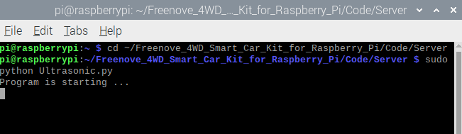

##############################################################################
Chapter 5 Ultrasonic Obstacle Avoidance Car 
##############################################################################

**If you have any concerns, please feel free to contact us via support@freenove.com**

Description
****************************************************************

The obstacle avoidance function of the car mainly uses the HC-SR04 ultrasonic module. The ultrasonic module is controlled by the servo. The servo rotates to the left, middle and right repeatedly, so that the ultrasonic module measures the distance of obstacles on the left, middle and right directions. And then it controls the car to move according to different distances.

Run program
****************************************************************

If the terminal displays the directory as below, you can directly run the Ultrasonic.py.

.. image:: ../_static/imgs/Chapter_5_Ultrasonic_Obstacle_Avoidance_Car/Chapter5_00.png
    :align: center

1.	If not, execute the cd command:

.. code-block:: console

    $ cd ~/Freenove_4WD_Smart_Car_Kit_for_Raspberry_Pi/Code/Server

2.	Run Ultrasonic.py:

.. code-block:: console

    $ sudo python Ultrasonic.py

You can press "Ctrl + C" to end the program.

Code
================================================================

.. literalinclude:: ../../../freenove_Kit/Code/Server/Ultrasonic.py
    :linenos: 
    :language: python
    :lines: 1-83

Result analysis
================================================================

Let servo0 rotate back and forth to 30 degrees, 90 degrees and 150 degrees respectively. And the ultrasonic module also follows the movement to measure the obstacle distance of these three angles.

When distances detected on the left > 30cm, middle > 30cm, right > 30cm. It means that there is no obstacle within 30cm. So the car move forward.

When distances detected on the left < 30cm, middle < 30cm, right < 30cm, it means that the car enters a dead end, so the car move back and turned back.

When distances detected on the left<30cm, middle < 30cm, right > 30cm. It means that there is an obstacle on the left side of the car, so the car turn right.

When distances detected on the left>30cm, middle < 30cm, right < 30cm. It means that there is an obstacle on the right side of the car, so the car turn left.
