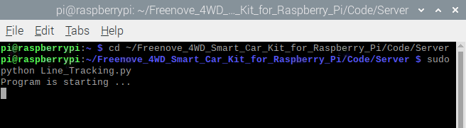
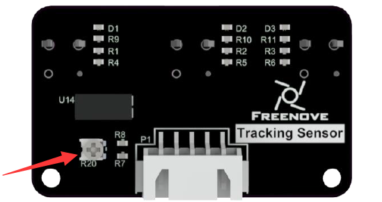

##############################################################################
Chapter 6 Infrared Line Tracking Car 
##############################################################################

**If you have any concerns, please feel free to contact us via support@freenove.com**

.. raw:: html

   <iframe height="500" width="690" src="https://www.youtube.com/embed/G3Q8xNatXgM" frameborder="0" allowfullscreen></iframe>

**If you have any concerns, please feel free to contact us via support@freenove.com**

The smart video car integrates the previous functions of light tracing, obstacle avoidance, line tracing, video transmission, face detection, LED and so on. And it is built with a server and a client, so it can be controlled remotely. 

Description
****************************************************************

The line tracing function of the car mainly uses an infrared module. When the sensor detects black line, the corresponding LED will light up, which controls the car to move according to the value of three sensors.

Run program
****************************************************************

If the terminal displays the directory as below, you can directly run the program.

.. image:: ../_static/imgs/Chapter_6_Infrared_Car/Chapter6_00.png
    :align: center

1.	If not, execute the cd command:

.. code-block:: console

    $ cd ~/Freenove_4WD_Smart_Car_Kit_for_Raspberry_Pi/Code/Server

2.	Run Line_Tracking.py:

.. code-block:: console

    $ sudo python Line_Tracking.py

You can press "Ctrl + C" to end the program.

If there are issues with the test, the infrared device may need to be adjusted. The adjustment screw is on top of the sensor. 

Code
================================================================

The code is as below:

.. literalinclude:: ../../../freenove_Kit/Code/Server/Line_Tracking.py
    :linenos: 
    :language: python
    :lines: 1-83

Result analysis
================================================================

There are 3 sensors on the left, middle and right. When the black line is detected by a sensor, it will show high level, or it is low.

When the sensor on left: high, middle: low, right: low, the car turns left lightly.

When the sensor on left: high, middle: high, right: low, the car turns left.

When the sensor on left: low, middle: high, right: low, the car moves forward straight.

When the sensor on left: low, middle: low, right: high, the car turns right lightly.

When the sensor on left: low, middle: high, right: high, the car turns right.
