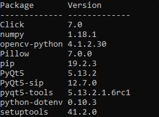
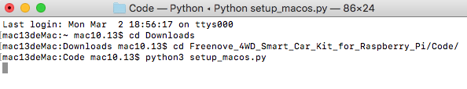
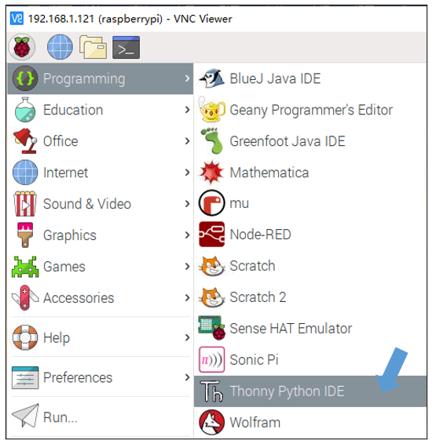

##############################################################################
Chapter 7 Smart video car 
##############################################################################

You can refer to this video: https://youtu.be/3WH4QYPWN-I

.. raw:: html

   <iframe style="display: block; margin: 0 auto;" height="421.875" width="750" src="https://www.youtube.com/embed/3WH4QYPWN-I" frameborder="0" allowfullscreen></iframe>

**If you have any concerns, please feel free to contact us via:** support@freenove.com

The smart video car integrates the previous functions of light tracing, obstacle avoidance, line tracing, video transmission, face detection, LED and so on. And it is built with a server and a client, so it can be controlled remotely. 

Server
****************************************************************

Open Server
==============================

Step 1 Login Raspberry Pi via VNC viewer 
--------------------------------------------------

:red:`Because server and client use GUI. You need use VNC viewer as remote desktop way.`

Download and install VNC Viewer according to your computer system by clicking following link:

https://www.realvnc.com/en/connect/download/viewer/

After installation is completed, open VNC Viewer. And click File -> New Connection. Then the interface is shown below. 

Enter IP address of your Raspberry Pi and fill in a Name. And click OK.

Then on the VNC Viewer panel, double-click new connection you just created, and the following dialog box pops up. Enter username: :blue:`pi` and Password: :blue:`raspberry`. And click OK.  

|

:red:`If the resolution ratio is not great or there is just a` **little window** :red:`, you can set a proper resolution ratio via steps below.`

.. code-block:: console

    $ sudo raspi-config

Select Screen Configuration. Select the appropriate resolution in the new window. Click Apply. 

In addition, your VNC Viewer window may zoom your Raspberry Pi desktop. You can change it. On your VNC View control panel, click right key. And select Properties->Options label->Scaling. Then set proper scaling. 

Step 2 Run commands
----------------------------------------------------------------

If you are using remote desktop mode to login Raspberry Pi, you need use VNC viewer.

Enter the following command in the terminal.

1.	Use cd command to enter directory where main.py is located:

.. code-block:: console

    $ cd ~/Freenove_4WD_Smart_Car_Kit_for_Raspberry_Pi/Code/Server

2.	Run main.py:

.. code-block:: console

    $ sudo python main.py

The interface is as below:

Sever Auto Start 
----------------------------------------------------------------

1	Open the terminal and execute the following two commands respectively to create a "start.sh” file.

.. code-block:: console

    $ cd ~
    $ sudo touch start.sh

2	Open "start.sh”.

.. code-block:: console

    $ sudo nano start.sh

3	Add the following contents to "start.sh” file.

.. code-block:: shell

    #!/bin/sh
    cd "/home/pi/Freenove_4WD_Smart_Car_Kit_for_Raspberry_Pi/Code/Server"
    pwd	
    sleep 10
    sudo python main.py
 
Press Ctrl + O and then press Enter to save it. Press Ctrl+X to exit.

4	Modify permissions.  

.. code-block:: console

    $ sudo chmod 777 start.sh

5	Enter the following command to create a directory.

.. code-block:: console

    $ mkdir ~/.config/autostart/

6	create and open "start.desktop” file

.. code-block:: console

    $ sudo nano .config/autostart/start.desktop

7	Add the following content to "start.desktop” file.

.. code-block:: shell

    [Desktop Entry]
    Type=Application
    Name=start
    NoDisplay=true
    Exec=/home/pi/start.sh

Press Ctrl + O and then press Enter to save it. Press Ctrl+X to exit.

8	Modify permissions.  

.. code-block:: console

    $ sudo chmod +x .config/autostart/start.desktop

9	Finally enter the following content to reboot Raspberry Pi.

.. code-block:: console

    $ sudo reboot

Note: To cancel auto start, please delete the files "start.sh” and "start.desktop” created above.

.. code-block:: console

    $ cd ~
    $ sudo rm start.sh
    $ sudo rm .config/autostart/start.desktop

Client
****************************************************************

The client connects to the server through TCP, which receives the video stream from the server, and other commands. And it also sends commands to the server to control the car. 

Clients can run on different systems, such as windows, Linux, and so on. However, you need to install related software and libraries.

The related program is mainly in the Video.py file under the Client folder.

Part of client code is as below:

.. literalinclude:: ../../../freenove_Kit/Code/Client/Video.py
    :linenos: 
    :language: python
    :lines: 13-78
    
Run client on windows system
===========================================

There are two ways to run Client on Windows.

Option 1 Running executable file directly
------------------------------------------------

Find the "Client.exe” file in the specified directory, double click it and the Client is opened.

The client interface is shown as below:

.. image:: ../_static/imgs/Chapter_7_Smart_video_car/Chapter7_10.png
    :align: center

After the client opens successfully, you need open the Raspberry Pi and :ref:`Open Server first <fnk0043/codes/tutorial/7_smart_video_car:open server>` , then enter the IP address of the Raspberry Pi in the white IP edit box, and then click "Connect” to connect smart car to Raspberry Pi. After the connection is successful, you can click on the controls on the interface to operate the car.

.. note:: 
    
    :red:`when Raspberry Pi is shut down, server will be closed. You need open server again the next time.`

:red:`If pressing forward but the car moves backward, please refer to page 51 to modify the code.`

Option 2 Install python3 and some related python libraries to run the client 
-----------------------------------------------------------------------------------------

If you want to modify the client, please follow this section.

This section will be completed in your **computer with windows system,** :red:`not Raspberry Pi`.

There are many relevant software and libraries needed to be installed in Windows system, which takes a long time. At this time, it does not need to run Server or use Raspberry Pi. You can shut down Raspberry Pi first. After the installation is completed, you need to open Raspberry Pi and server again.

Install python3
----------------------------------------------------------------

Download the installation file:

https://www.python.org/downloads/windows/

.. image:: ../_static/imgs/Chapter_7_Smart_video_car/Chapter7_11.png
    :align: center

Click Latest Python 3 Release - Python 3.8.1

Choose and download Windows x86 executable installer. After downloading successfully, install it.

Select "**Add Python 3.8 to PATH**". You can choose other installation features.

.. image:: ../_static/imgs/Chapter_7_Smart_video_car/Chapter7_14.png
    :align: center

Select all options and click "Next".

Here, my install location is D. You can also choose other location. Then click "Install”.

Wait installing.

.. image:: ../_static/imgs/Chapter_7_Smart_video_car/Chapter7_17.png
    :align: center

Now, installation is completed.

Install PyQt5、opencv、numpy and other libraries.      
----------------------------------------------------------------

If have not download the zip file, do so via:

https://github.com/Freenove/Freenove_4WD_Smart_Car_Kit_for_Raspberry_Pi/archive/master.zip

Then unzip it and delete "-master” to rename it to "Freenove_4WD_Smart_Car_Kit_for_Raspberry_Pi”.

Then put it into D disk for example.

You can also place it into other disks (like E), but the path in the following command should be modified accordingly (replace D: by E:).

Press "win + R” and enter cmd, and click ok. Then enter following commands.

1.	Enter D disk. (If you put it into E, it should be E:)

.. code-block:: console

    D:

2.	Enter directory where setup_windows.py is located: (If you put it into E, it should be E:)

.. code-block:: console

    cd D:\\Freenove_4WD_Smart_Car_Kit_for_Raspberry_Pi\\Code

3.	Run setup_windows.py:

.. code-block:: console

    Python3 setup_windows.py

Or enter the unzipped directory Freenove_4WD_Smart_Car_Kit_for_Raspberry_Pi\\Code\\Client. 

And double-click **setup_client.py** or open it with python3.

Installation will take some time. Just wait patiently. For successful installation, it will prompt "All libraries installed successfully":

If not all installations are successful, it will prompt "Some libraries have not been installed yet. Please run ' Python3 setup_windows.py ' again", then you need to execute the Python3 setup_windows.py command again. Most of the installation failures are caused by poor networks. You can check your network before installing.

Open client
----------------------------------------------------------------

Press "win + R” and enter cmd, and click ok. Then enter following commands.

1.	Enter D disk. If you put it into E, it should be E:

.. code-block:: console

    D:

2.	Enter directory where Main.py is located:

.. code-block:: console

    cd D:\\Freenove_4WD_Smart_Car_Kit_for_Raspberry_Pi\\Code\\Client

3.	Run Main.py:

.. code-block:: console

    python Main.py

Or enter the unzipped directory and enter following directory: Freenove_4WD_Smart_Car_Kit_for_Raspberry_Pi\Code\Client. And double-click Main.py or open it with python to open the client.

The client interface is shown as below:

After the client opens successfully, you need open the Raspberry Pi and  :ref:`open server first <fnk0043/codes/tutorial/7_smart_video_car:open server>` first, then enter the IP address of the Raspberry Pi in the white IP edit box, and then click "Connect” to connect smart car to Raspberry Pi. After the connection is successful, you can click on the controls on the interface to operate the car.

.. note::
    
    :red:`when Raspberry Pi is shut down, server will be closed. You need open server again the next time.`

:red:`If pressing forward but the car moves backward, please refer to page 51 to modify the code.`

Control
----------------------------------------------------------------

And you can also control the car with following blue keys.

The car has four work modes:

.. list-table:: 
    :width: 100%
    :widths: 50 70
    :align: center
    :header-rows: 1

    *   -   Mode  
        -   Function 

    *   -   M-Free(Mode1)
        -   Free control mode

    *   -   M-Light(Mode2)
        -   Light tracing mode
  
    *   -   M-Sonic(Mode3)
        -   Ultrasonic obstacle avoidance mode
  
    *   -   M-Line(Mode4)
        -   Infrared line tracking mode

The following is the corresponding operation of the buttons and keys.

.. list-table:: 
    :width: 100%
    :widths: 50 30 50
    :align: center
    :header-rows: 1

    *   -   Button on Client
        -   Key 
        -   Action

    *   -   ForWard
        -   W
        -   Move

    *   -   BackWard
        -   S
        -   Back off
  
    *   -   Turn left
        -   A
        -   Turn left
  
    *   -   Turn Right
        -   D
        -   Turn Right

    *   -   Left
        -   left arrow
        -   Turn camera left

    *   -   Right
        -   right arrow
        -   Turn camera right

    *   -   Up
        -   up arrow
        -   Turn camera up
  
    *   -   Down
        -   down arrow
        -   Turn camera down
  
    *   -   Home
        -   Home
        -   Turn camera back Home

    *   -   Connect/ Disconnect
        -   C 
        -   On/off Connection

    *   -   Open Video/ Close Video
        -   V
        -   On/off Video

    *   -   Mode 1,2,3,4
        -   Q
        -   Switch Mode
  
    *   -   Buzzer
        -   Space
        -   On/off Buzzer
  
    *   -   Led 1,2,3,4,5,6,7,8
        -   1,2,3,4,5,6,7,8
        -   On/off Led 1,2,3,4,5,6,7,8

    *   -   Led_Mode 1,2,3,4
        -   L
        -   Switch Led Mode
  
The function of SliderBar is below:

.. list-table:: 
    :width: 100%
    :widths: 20 50
    :align: center
    :header-rows: 1
    :class: zebra

    *   -   SliderBar
        -   Function

    *   -   Servo 1,2
        -   SliderBar Servo 1, 2 are used to slightly adjust the angle. If the servo is not
            
            fully centered during installation, you can slightly tune it via the SliderBar.
        
Other control information:

.. list-table:: 
    :width: 100%
    :widths: 30 50
    :align: center
    :header-rows: 1
    :class: zebra

    *   -   Control
        -   Function

    *   -   IP address Edit box
        -   Enter IP address of Raspberry Pi

    *   -   Power box
        -   Show power level

    *   -   R,G,B Edit box
        -   Control the color of LED selected.

    *   -   Button "Ultrasonic"
        -   Show the distance from obstacle.

    *   -   Button "Light "
        -   Show voltage of two photoresistors.

    *   -   Button "Tracing-On/Off "
        -   Open and close  face tracking

If you don't want to enter IP address after open the client, you can make some modification as below:

1.	Open "Client_Ui.py” under directory "Client”, then find code in the thirty-sixth line from the bottom.

.. code-block:: python

    self.IP.setText(_translate("Client", "IP address", None))

2.	Modify IP address to IP address of your Raspberry Pi. For example, my rpi IP is 192.168.1.116. After modification, it should be as below:

.. code-block:: python

    self.IP.setText(_translate("Client", "192.168.1.116", None))

Then save and close. And then restart your client. You can see it is modified successfully.

Run client on macOS system
================================================================

Here take MacOS 10.13 as an example. To run the client on MacOS, you need to install some software and libraries. At this time, it does not need to run the server or use the Raspberry Pi. So you can turn off the Raspberry Pi first. After the installation is complete, turn on the Raspberry Pi and run the server. MacOS 10.13 comes with python2, but no python3. However, the programs in this project need run under python3, so you need to install it first.

Install python3
----------------------------------------------------------------

Download installation package, link: https://www.python.org/downloads/

.. image:: ../_static/imgs/Chapter_7_Smart_video_car/Chapter7_23.png
    :align: center

:combo:`x-large:your macOS is 11. Like 11.0, please install` :combo:`x-large red:python 3.9.`

:combo:`x-large:If your macOS is NOT 11, like 10.15, please install` :combo:`x-large red:python 3.8.` :combo:`x-large purple:If you have installed python 3.9. You need uninstall it first.`

.. image:: ../_static/imgs/Chapter_7_Smart_video_car/Chapter7_24.png
    :align: center

At bottom of the page, click macOS 64-bit installer and download installation package.

Click Continue.

.. image:: ../_static/imgs/Chapter_7_Smart_video_car/Chapter7_26.png
    :align: center

Click Continue

.. image:: ../_static/imgs/Chapter_7_Smart_video_car/Chapter7_27.png
    :align: center
    
Click Agree.

Click Install. If your computer has a password, enter the password and Install Software.

Now the installation succeeds.

You can find it in Aapplications.

Install PyQt5、opencv、numpy and other libraries
----------------------------------------------------------------

If there is no code for this car in your macOS system device, you can download it via the link below:

https://github.com/Freenove/Freenove_4WD_Smart_Car_Kit_for_Raspberry_Pi/archive/master.zip

After downloaded successfully, you can find it under Downloads.

.. image:: ../_static/imgs/Chapter_7_Smart_video_car/Chapter7_31.png
    :align: center

Open the Terminal.

.. image:: ../_static/imgs/Chapter_7_Smart_video_car/Chapter7_32.png
    :align: center

Type following commands in Terminal.

1. Enter "Downloads", (Where the Car code is located. If your location for it is different, please enter the location in your device.)

.. code-block:: console

    $ cd Downloads

2. Enter directory where setup_macos.py is located:

.. code-block:: console

    $ cd Freenove_4WD_Smart_Car_Kit_for_Raspberry_Pi/Code/

3. Run setup_macos.py:
   
.. code-block:: console

    $ python3 setup_macos.py

Installation will take some time. Just wait patiently. For successful installation, it will prompt "All libraries installed successfully":

.. image:: ../_static/imgs/Chapter_7_Smart_video_car/Chapter7_34.png
    :align: center

If not all installations are successful, it will prompt "Some libraries have not been installed yet. Please run 'python3 setup_macos.py' again", then you need to execute the python3 setup_macos.py command again. Most of the installation failures are caused by poor networks. You can check your network before installing.

If you are using :blue:`macOS under 11.0, like 10.15.` **Just skip to "Open client”.**

If you are using :blue:`macOS 11.0 or later version.` Please run commands below:

.. code-block:: console

    $ pip3 uninstall PyQt5
    $ pip3 install PyQt5

Open client
----------------------------------------------------------------

Following the previous step, after the installation is completed, you are now in the directory where setup_macos.py is located.

1.Type following command to enter Client folder.

.. code-block:: console

    $ cd Client/

2.Type following command to run Main.py.

.. code-block:: console

    $ python3 Main.py

The control way of Raspberry Pi macOS System client is same with Windows (Control).

Run client in Raspberry Pi (Linux system)
===========================================================

Install Opencv library
------------------------------------------------------------

Execute the following commands in the terminal to install Opencv library:

1.	Install opencv development environment:

.. code-block:: console

    $ sudo apt-get install -y libopencv-dev python3-opencv

2.	Install some tools:

.. code-block:: console

    $ sudo apt-get install -y  python3-pil python3-tk

Run client
------------------------------------------------------------

Enter the following commands at the terminal.

1.	Use the cd command to go to the directory where Main.py is located.

.. code-block:: console

    $ cd ~/Freenove_4WD_Smart_Car_Kit_for_Raspberry_Pi/Code/Client

2.	Run Main.py:

.. code-block:: console

    $ sudo python Main.py

The interface is shown below:

**Please check whether the camera protective film is torn off.**

Troubleshooting
================================================================

.. image:: ../_static/imgs/Chapter_7_Smart_video_car/Chapter7_38.png
    :align: center

**If the car works abnormally, it may be caused by following reasons: Raspberry Pi system is stuck or batteries have no power.**

You need check batteries power indicator or recharge batteries. Make sure batteries have enough power. When the batteries voltage is less than 7V, the buzzer will make regular sound.

If the batteries are OK, Raspberry Pi system is stuck. You need wait some time to check if the client works. Or reopen the server and client. 

The latest Raspberry Pi official system is not stable. It occasionally is stuck. The old version is more stable.

If the Raspberry Pi system is stuck for a long time, you need reboot Raspberry Pi.

If you have any concerns, please feel free to contact us with pictures:  

`support@freenove.com <support@freenove.com>`_

Android and iOS app
****************************************************************

You can download and install the Freenove Android app from below:

On Google play:

https://play.google.com/store/apps/details?id=com.freenove.suhayl.Freenovez

On GitHub:

https://github.com/Freenove/Freenove_App_for_Android

In this github repository, you can find the App instruction (Tutorial.pdf).

You can download and install the Freenove iPhone ios app by searching freenove in app store.

Open the app and select the car.

Open the server in Raspberry Pi car first. And enter your Pi IP.

Free innovation
****************************************************************

If you have any concerns, please feel free to contact us via **support@freenove.com**

If you want to write your own program to control the car, just follow this section. We will teach you how to program this car. 

If you have never learned python before, you can learn some basic knowledge via the link below: https://python.swaroopch.com/basics.html

First, turned on S1 and S2. Then open Raspberry Pi, right click and create a new folder on the desktop: Test

Open Freenove_4WD_Smart_Car_Kit_for_Raspberry_Pi/Code/Server in your Raspberry Pi and copy the following **8 files** into the Test folder we created. 

Paste them in Test folder.

Run Thonny Python IDE

|

Click Save and save it into the Test folder, with name: test_Code.

Now you can see the file test_Code.py we created.

Then write code in test_Code.py, then click save.

.. note:: 
    
    The code and library are written by Python 3. You need execute the code with python 3.

Open the terminal and use the following command to enter the directory where test_Code.py is located:

.. code-block:: console

    $ cd ~/Desktop/Test

Run test_Code.py:

.. code-block:: console

    $ sudo python  test_Code.py

Code example
================================================================

Following are code example for the parts. For more detail, please refer to :ref:`Module test section <fnk0043/codes/tutorial/2_assemble_smart_car:run program>`.

For more details, please refer to :ref:`Motor <fnk0043/codes/tutorial/3_module_test:motor>`.

.. code-block:: python

    from Motor import *                       #import Motor
    PWM=Motor()                               #create an object
    PWM.setMotorModel(2000,2000,2000,2000)    #Forward
    time.sleep(3)                             #waiting 3 second
    PWM.setMotorModel(0,0,0,0)                #Stop

ADC. For more details, please refer to :ref:`ADC <fnk0043/codes/tutorial/3_module_test:adc module>`.

.. code-block:: python

    from ADC import *             #import ADC
    adc=Adc()                     #create an object
    Left_IDR=adc.recvADC(0)       #get value
    print ("The photoresistor voltage on the left is "+str(Left_IDR)+"V")

LED. For more details, please refer to :ref:`LED <fnk0043/codes/tutorial/3_module_test:led>`.

.. code-block:: python

    from Led import *                       #import Led     
    led=Led()                               #create an object
    led.ledIndex(0x04,255,255,0)               #yellow
    led.ledIndex(0x80,0,255,0)                 #green
    time.sleep(5)                           #wait 5s
    led.colorWipe(led.strip, Color(0,0,0))  #turn off

Buzzer. For more details, please refer to :ref:`Buzzer <fnk0043/codes/tutorial/3_module_test:buzzer>`.

.. code-block:: python

    from Buzzer import *                #import Led
    from Command import COMMAND as cmd  #import Led
    buzzer=Buzzer()                     #create an object
    buzzer.run('1')           #Start
    time.sleep(3)                       #wait 3s
    buzzer.run('0')            #Stop

Servo. For more details, please refer to :ref:`Servo <fnk0043/codes/tutorial/3_module_test:servo>`.

.. code-block:: python

    from servo import *   #import Led
    pwm = Servo()           #create an object
    #Servo rotates from 30 degrees to 150 degrees
    for i in range(30, 150, 1) :
        pwm.setServoPwm('0', i)
        time.sleep(0.01)
    #Servo rotates from 150 degrees to 0 degrees
    for i in range(150, 30, -1) :
        pwm.setServoPwm('0', i)
        time.sleep(0.01)
    
Ultrasonic module. For more details, please refer to :ref:`Ultrasonic module <fnk0043/codes/tutorial/2_assemble_smart_car:ultrasonic>`.

.. code-block:: python

    from Ultrasonic import *         #import Led 
    ultrasonic=Ultrasonic()          #create an object            
    data=ultrasonic.get_distance()   #Get the value
    print ("Obstacle distance is "+str(data)+"CM")

These codes can be integrated into one code to achieve your requirement. 
