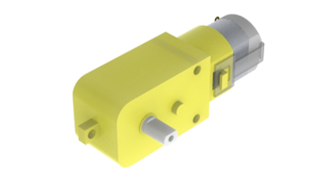
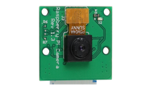
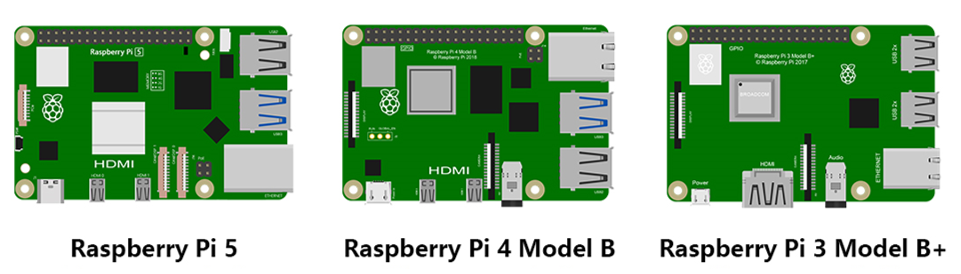

##############################################################################
List
##############################################################################

If you have any concerns, please feel free to contact us via support@freenove.com

4WD Smart Car Board for Raspberry Pi
****************************************************************

  
Machinery Parts
****************************************************************

.. list-table::
   :align: center
   :class: table-line

   * - |List02|
     - |List03|
     - |List04|
     - |List05|
     - |List06|

   * - |List07|
     - |List08|
     - |List09|
     - |List10|
     - 

.. |List02| image:: ../_static/imgs/List/List02.png
.. |List03| image:: ../_static/imgs/List/List03.png

.. |List05| image:: ../_static/imgs/List/List05.png
.. |List06| image:: ../_static/imgs/List/List06.png

.. |List09| image:: ../_static/imgs/List/List09.png
.. |List10| image:: ../_static/imgs/List/List10.png

.. note::
    
    :combo:`red font-bolder:You may receive M1.4*4 or M1.4*5. Can be used normally`

Transmission Parts
****************************************************************

.. table:: 
  :widths: 50 50
  :width: 80%
  :align: center
  :class: table-line

  +-----------------------------------+-----------------------------------+
  | Servo package x2                  | Driven wheel x4                   |     
  |                                   |                                   |       
  |  |List11|                         |  |List12|                         |                                                                  
  +-----------------------------------+-----------------------------------+
  | DC speed reduction motor x4       | Motor bracket package  x4         |     
  |                                   |                                   |       
  |  |List13|                         |  |List14|                         |       
  +-----------------------------------+-----------------------------------+

.. |List11| image:: ../_static/imgs/List/List11.png

.. |List14| image:: ../_static/imgs/List/List14.png

Acrylic Parts
****************************************************************

.. container:: centered
    
    :xx-large:`For Pan Tilt`

.. image:: ../_static/imgs/List/List15.png
    :align: center
    :width: 50%
  
Electronic Parts
****************************************************************

.. note::

  :combo:`red font-bolder:There are two models of connection boards, remember their version numbers.`
  
.. table:: 
    :width: 80%
    :align: center
    :class: table-line
  
    +---------------------------+---------------------------------+-----------------------------+
    |  Line tracking module x1  |  Camera x1                      | HC-SR04 Ultrasonic Module x1|   
    |                           |                                 |                             |   
    |    |List16|               |   |List17|                      |   |List18|                  |   
    +---------------------------+----------------+----------------+-----------------------------+
    | Connection board (PCB_V1.0)                |  Connection board (PCB_V2.0)                 |   
    |                                            |                                              |   
    |    |List19|                                |    |List20|                                  |   
    +--------------------------------------------+----------------------------------------------+
    |  Jumper Wire F/F(4) x1                                                                    |   
    |                                                                                           |   
    |    |List21|                                                                               |   
    +-------------------------------------------------------------------------------------------+
    |  XH-2.54-5Pin cable x1                                                                    |   
    |                                                                                           |   
    |    |List22|                                                                               |   
    +-------------------------------------------------------------------------------------------+
    |  FPC soft line x1                                                                         |   
    |                                                                                           |   
    |    |List23|                                                                               |   
    +-------------------------------------------------------------------------------------------+
    |  FPC soft line x1                                                                         |   
    |                                                                                           |   
    |    |List24|                                                                               |   
    +-------------------------------------------------------------------------------------------+

.. note:: 

    :combo:`red font-bolder:Please note that this cable only come with the purchase of the Raspberry Pi 5 version.`

.. |List18| image:: ../_static/imgs/List/List18.png
.. |List19| image:: ../_static/imgs/List/List19.png
.. |List20| image:: ../_static/imgs/List/List20.png

.. |List24| image:: ../_static/imgs/List/List24.png

Tools
****************************************************************

.. list-table::
   :align: center
   :widths: 60 50 50
   :class: table-line

   * - Cross screwdriver (3mm) x1
     - Black tape x1
     - Cable Tidy x25cm

   * - |List25|
     - |List26|
     - |List27|

Self-prepared Parts
****************************************************************

.. table:: 
  :width: 80%
  :align: center
  :class: table-line

  +-------------------------------------------------------------------------------------------+
  | Please refer to About_Battery.pdf in unzipped folder.                                     |   
  |                                                                                           |   
  |    |List28|                                                                               |   
  +-------------------------------------------------------------------------------------------+
  | Raspberry Pi (:combo:`red font-bolder:Recommended model: Raspberry 5 / 4B / 3B+`) x1      |   
  |                                                                                           |   
  |    |List29|                                                                               |   
  +-------------------------------------------------------------------------------------------+

.. |List28| image:: ../_static/imgs/List/List28.png
